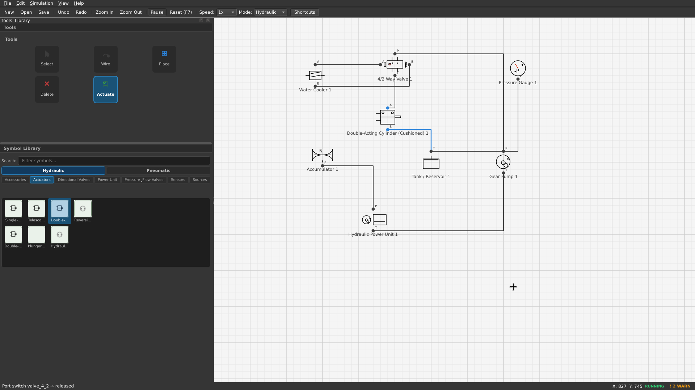

# FluidSim Linux

A **Linux-native replacement** for [FluidSim 4.2](https://www.festo.com), an interactive hydraulic & pneumatic circuit simulator. Build circuits visually, wire components together, and run real-time physics simulations — all without Wine.

[](https://www.python.org/)
[](https://pypi.org/project/PySide6/)
[](LICENSE)



<video controls preload="metadata" width="100%" max-width="800">
  <source src="docs/demo.mp4" type="video/mp4">
  Your browser does not support the video tag.
</video>

## Features

### Core Simulation
- Real-time hydraulic and pneumatic circuit simulation with full ISO 1219 symbols
- Interactive drag-and-drop component placement with snap-to-grid
- Auto-routed L-shaped wire connections with port detection
- Physics engine: pressure propagation, cylinder forces, valve switching, spring return
- Live simulation visualization — cylinders extend/retract, gauges move, valves glow when actuated

### Circuit Validation
- Real-time error detection in the status bar
- 🔴 Red warnings for floating components, unknown references
- 🟡 Orange warnings for incomplete connections
- 🔵 Blue info for circuit loop detection
- Validates before starting simulation to catch wiring mistakes early

### Symbol Library (117 components)
- **Hydraulic**: 48 symbols — pumps, cylinders, motors, valves, sensors, accessories
- **Pneumatic**: 30 symbols — compressors, air supplies, cylinders, valves, sensors
- **Electrical**: 22 symbols — power supplies, motors, relays, switches, semiconductors
- **Digital & Control**: 17 symbols — logic gates, flip-flops, timers, PLCs, displays

### User Interface
- Modern icon-based tool palette (Select, Wire, Place, Delete, Actuate)
- Symbol library with category tabs, thumbnail previews, and global search
- Categorized properties panel with live simulation values
- Keyboard shortcuts: `V` Select · `W` Wire · `P` Place · `X` Delete · `A` Actuate · `R` Rotate
- Zoom with mouse wheel, pan with middle mouse button
- Export circuits as PNG or SVG

### File Support
- Save/load circuits in JSON format
- Import `.ct` files from FluidSim 4.2 (Festo Didactic)
- Browse and preview existing FluidSim 4.2 libraries

## System Requirements

- **OS**: Linux (any recent distribution with X11/Wayland)
- **Python**: 3.8 or higher
- **Dependencies**: PySide6 ≥ 6.5.0, numpy ≥ 1.21.0

## Download & Install

### Option 1: Git (recommended for development)
```bash
git clone https://github.com/BayazidHabibSiddikee/Fluidsim-Linux.git
cd FluidSim-Linux
pip install -r requirements.txt
python3 main.py
```

### Option 2: Release tarball
Download the latest `.tar.gz` from the [Releases page](https://github.com/BayazidHabibSiddikee/Fluidsim-Linux/releases).
Unpack and run:
```bash
tar xzf fluidsim-linux-v*.tar.gz
cd FluidSim-Linux
python3 main.py
```

### Option 3: Package Manager
Install from your distro's package repository or use Flatpak/AppImage (coming soon).

## Installation Dependencies

```bash
# Install dependencies
pip install -r requirements.txt

# Or manually
pip install "PySide6>=6.5.0" "numpy>=1.21.0"
```

## Usage

### Quick Start
```bash
python3 main.py
```

Or use the launcher for additional options:
```bash
python3 launcher.py          # Launcher menu (simulator + .ct browser)
python3 main.py --mode hydraulic   # Start directly in hydraulic mode
python3 main.py --mode pneumatic   # Start directly in pneumatic mode
```

### Launcher Scripts
```bash
bin/fl_sim          # Launch circuit simulator
bin/fl_sim_h        # Launch in hydraulic mode
bin/fl_sim_p        # Launch in pneumatic mode
```

## Building Your First Circuit

### Circuit 1: Double-Acting Cylinder with Valve Control ⭐ Recommended

This is the simplest working circuit that demonstrates full extend/retract behavior.

**Components (drag from library):**
| Component | Category | Purpose |
|-----------|----------|---------|
| Gear Pump | Hydraulic → Sources | Pressure source |
| 4/2 Way Valve | Hydraulic → Directional Valves | Direction control |
| Double-Acting Cylinder | Hydraulic → Actuators | Linear actuator |
| Tank / Reservoir | Hydraulic → Accessories | Fluid reservoir / ground |

**Connections (use Wire tool):**
```
Pump(P)  ──→  Valve(P)
Valve(A) ──→  Cylinder(A)
Cylinder(B) ──→  Valve(B)
Valve(T) ──→  Tank(T)
```

**How to test:**
1. Press **F5** (Start) to begin simulation
2. **Click the Actuate tool** (or press `A`), then click the valve to toggle it ON
3. Watch the cylinder **extend** as pressure pushes it
4. **Toggle the valve OFF** — pressure drains and the cylinder **retracts**
5. Toggle again to repeat

### Circuit 2: Single-Acting Cylinder

A simpler circuit that extends when pressurized and retracts via spring.

**Components:**
- Gear Pump, 2/2 Way Valve, Single-Acting Cylinder, Tank

**Connections:**
```
Pump(P)  ──→  Valve(P)
Valve(A) ──→  Cylinder(A)
Cylinder(T) ──→  Tank(T)
```

**Note:** Single-acting cylinders require the **Actuate tool** (`A`) to toggle the valve. They extend when the valve is ON and spring-back when OFF.

### Circuit 3: Pressure Relief Valve Protection

Demonstrates pressure regulation with a relief valve.

**Components:**
- Gear Pump, Relief Valve, Double-Acting Cylinder, Tank

**Connections:**
```
Pump(P)  ──→  Relief Valve(P)
Relief Valve(A) ──→  Cylinder(A)
Cylinder(B) ──→  Tank(T)
Relief Valve(T) ──→  Tank(T)
```

**How it works:** Pressure builds until the relief valve opens at its set point (~200 bar default), protecting the circuit from over-pressurization.

## Controls Reference

| Key | Action |
|-----|--------|
| `F5` | Start / Pause simulation |
| `F6` | Step simulation one frame |
| `F7` | Reset simulation |
| `F1` | Show keyboard shortcuts |
| `V` | Select tool |
| `W` | Wire tool |
| `P` | Place tool |
| `X` | Delete tool |
| `A` | Actuate tool (toggle valve state) |
| `R` | Rotate selected component |
| `Esc` | Deselect / cancel |
| `Ctrl+N` | New circuit |
| `Ctrl+O` | Open circuit |
| `Ctrl+S` | Save circuit |
| `Ctrl+Z` | Undo |
| `Ctrl+Y` | Redo |
| Mouse wheel | Zoom in/out |
| Middle mouse drag | Pan canvas |

## Status Bar Indicators

The status bar at the bottom shows real-time feedback:

- **✓ OK** (green) — Circuit is valid, no errors
- **⚠ N ERRORS** (red) — Circuit has errors, hover for details
- **! N WARN** (orange) — Circuit has warnings, hover for details
- **RUNNING** (green) — Simulation is active
- **X: ## Y: ##** — Current mouse position in scene coordinates

## Architecture

```
FluidSim-Linux/
├── main.py                     # Entry point
├── launcher.py                 # Dual-mode launcher (simulator + .ct browser)
├── requirements.txt            # Python dependencies
├── src/
│   ├── app.py                  # MainWindow — orchestrates all UI panels
│   ├── ui/                     # Modern UI components
│   │   ├── canvas.py           # Circuit editing canvas with rendering
│   │   ├── tools.py            # Icon-based tool palette
│   │   ├── library.py          # Symbol library with categories & search
│   │   ├── properties.py       # Properties panel with live simulation values
│   │   ├── icons.py            # Procedural icon generation (no assets needed)
│   │   └── validator.py        # Circuit validation & error detection
│   ├── simulation/
│   │   └── engine.py           # Physics engine (pressure, flow, mechanics)
│   ├── symbols/
│   │   └── library.py          # 117 ISO schematic symbols + port definitions
│   └── tools/
│       ├── ct_browser.py       # FluidSim 4.2 .ct file browser
│       └── ct_import.py        # .ct file import and decompression
├── bin/
│   ├── fl_sim                  # Launcher script (simulator)
│   ├── fl_sim_h                # Launcher script (hydraulic mode)
│   └── fl_sim_p                # Launcher script (pneumatic mode)
├── icons/                      # Application icons
└── tests/                      # Test suite
```

## Releases & Packages

| Version | File | Size | Notes |
|---------|------|------|-------|
| v0.1.0 | [`fluidsim-linux-v0.1.0.tar.gz`](releases/fluidsim-linux-v0.1.0.tar.gz) | 1.3 MB | First stable release |

To install as a system application (adds to your desktop menu):
```bash
sudo cp ~/.local/share/applications/fluidsim.desktop /usr/share/applications/
sudo cp ~/.local/share/icons/hicolor/256x256/apps/fluidsim.png /usr/share/icons/hicolor/256x256/apps/
```

## Technical Details

### Simulation Engine
The physics engine uses a time-stepped approach with fixed timestep integration:

- **Pressure propagation**: Flood-fill algorithm propagates pressure from sources through open valves to actuators
- **Cylinder dynamics**: Force = ΔP × Area, acceleration = F/m, with damping and spring return
- **Valve logic**: Directional valves only pass pressure when actuated; closed valves block flow instantly
- **Instant drain**: Non-pressurized nodes drop to atmospheric pressure immediately for responsive behavior
- **Spring return**: Single-acting cylinders and cushioned cylinders have configurable spring constants

### Symbol Standards
All symbols follow [ISO 1219](https://www.iso.org/standard/45506.html) hydraulic and pneumatic circuit diagram standards, matching the original FluidSim 4.2 symbol catalog.

### File Formats
- **JSON** (`*.json`): Native save format with full component state
- **.ct** (`*.ct`): FluidSim 4.2 circuit files (import only, with decompression support)
- **PNG** / **SVG**: Image export for documentation and sharing

## Testing

```bash
# Run the UI test suite
python3 -m pytest test_ui.py -v

# All 6 tests cover:
#   - App startup and widget creation
#   - Tool palette with icons
#   - Symbol library categories and search
#   - Properties panel with live values
#   - Canvas rendering and interactions
#   - Icon generation and validity
```

## Contributing

Contributions are welcome! Please read the [MISSION.md](MISSION.md) for project goals and architecture.

1. Fork the repository
2. Create a feature branch (`git checkout -b feature/my-feature`)
3. Commit your changes (`git commit -am 'Add my feature'`)
4. Push to the branch (`git push origin feature/my-feature`)
5. Create a new Pull Request

### Code Style
- Follow [PEP 8](https://peps.python.org/pep-0008/) style guidelines
- Use type hints where appropriate
- Run tests before submitting: `python3 -m pytest test_ui.py -v`

## License

MIT License — see [LICENSE](LICENSE) for details.

## Acknowledgements

- **[FluidSim 4.2](https://www.festo.com/fluidsimit)** by Festo Didactic — inspiration for component catalog and ISO symbol standards
- **[PySide6](https://pypi.org/project/PySide6/)** — Qt6 Python bindings
- **ISO 1219** — International standard for fluid power systems and components

## Support

- **GitHub Issues**: Report bugs and request features
- **Documentation**: See [README.md](README.md) and [MISSION.md](MISSION.md)
- **Keyboard Shortcuts**: Press `F1` in the application for the full reference
